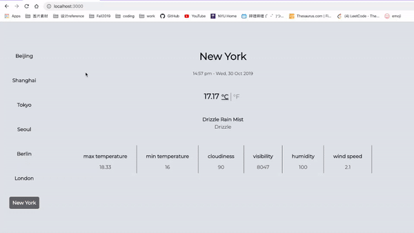

# Weather App

A simple weather app written in react.js.

### Features

* uses Openweathermap api
* display real time weather and time in different cities
* search weather by typing in city name in the url
* have night mode and day mode
* change background color based on cloudiness
* display image based on weather type

>### Demo

