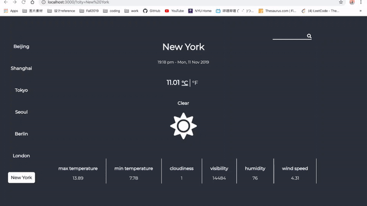

# Weather App

A simple weather app written in react.js.

### Features

* uses Openweathermap api
* display real time weather and time in different cities
* convert between fahrenheit and celcius
* search city using the search bar (updating the urlparams)
* have night mode and day mode
* change background color based on cloudiness
* display image based on weather type

### Demo

